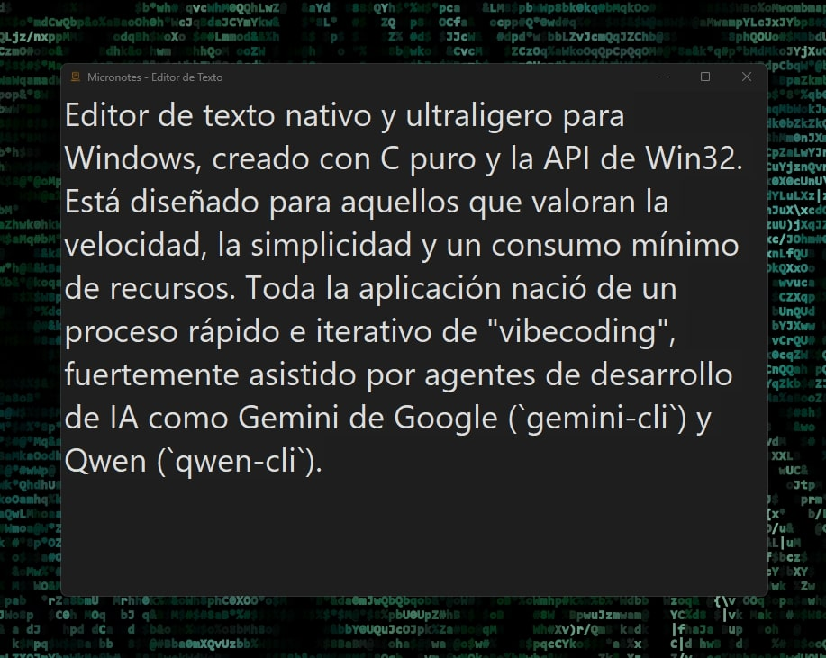

# ✒️ Micronotes (Edición Nativa en C)

  

**Micronotes** es un editor de texto nativo y ultraligero para Windows, creado con C puro y la API de Win32. Está diseñado para aquellos que valoran la velocidad, la simplicidad y un consumo mínimo de recursos. Toda la aplicación nació de un proceso rápido e iterativo de "vibecoding", fuertemente asistido por agentes de desarrollo de IA como Gemini de Google (`gemini-cli`) y Qwen (`qwen-cli`).

## 🌟 Características

-   **Rendimiento Nativo Puro:** Sin frameworks, sin motores web. Solo la velocidad pura de la API de Win32.
-   **Modo Oscuro:** Una interfaz de usuario cómoda y con tema oscuro para sesiones de escritura concentradas.
-   **Funcionalidad Básica del Editor:** Todos los elementos esenciales están aquí:
    -   Operaciones de archivo: Nuevo, Abrir (Ctrl + O) y Guardar (Ctrl + S).
    -   Manipulación de texto: Deshacer, Cortar, Copiar, Pegar, Eliminar y Seleccionar todo.
    -   Funcionalidad de Buscar y Reemplazar (Ambas con Ctrl + F).
-   **Personalización de Vista:**
    -   Alternar ajuste de línea (word wrap).
    -   Acercar, alejar y restablecer el zoom al valor predeterminado.
-   **Soporte Unicode:** Los archivos se leen y escriben utilizando codificación UTF-8.

## 🛠️ Cómo Compilar desde el Código Fuente

Puedes compilar Micronotes utilizando Microsoft Visual C++ (MSVC) o MinGW.

### 1. Usando Visual Studio (MSVC)

1.  Asegúrate de tener Visual Studio instalado con la carga de trabajo "Desarrollo de escritorio con C++".
2.  Simplemente ejecuta el script `build.bat` desde la raíz del proyecto.
3.  El script intentará automáticamente localizar tu instalación de Visual Studio, configurar el entorno y compilar la aplicación. El ejecutable final será `Micronotes.exe`.

### 2. Usando MinGW-w64

1.  Asegúrate de que el directorio `bin` de tu instalación de MinGW-w64 esté incluido en la variable `PATH` de tu sistema. Esto es necesario para que `gcc.exe` y `windres.exe` sean encontrados.
2.  Ejecuta el script `build_mingw.bat`.
3.  El script compilará los recursos y el código fuente, produciendo `Micronotes.exe`.

## 🤖 Metodología de Desarrollo: "Vibecoding"

Este proyecto es un testimonio de un enfoque de desarrollo moderno y ágil que llamo "vibecoding": una colaboración fluida y estructurada entre un desarrollador humano y múltiples asistentes de IA. En lugar de una planificación extensa, el desarrollo se realiza en iteraciones atómicas rápidas, utilizando la IA para generar, refactorizar y depurar código, mientras el desarrollador proporciona la guía arquitectónica y el control de calidad. Esta sinergia permite la creación de software nativo de alta calidad en una fracción del tiempo tradicional.

## ✍️ Autor

Desarrollado con pasión por Martín Dumont ([martdumo](https://github.com/martdumo)).

Este proyecto sirve como prueba de concepto de cómo la colaboración entre humanos e IA puede revitalizar el desarrollo de software clásico de alto rendimiento.

**Licencia:** MIT
